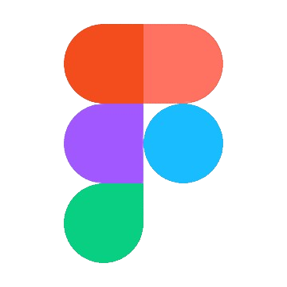
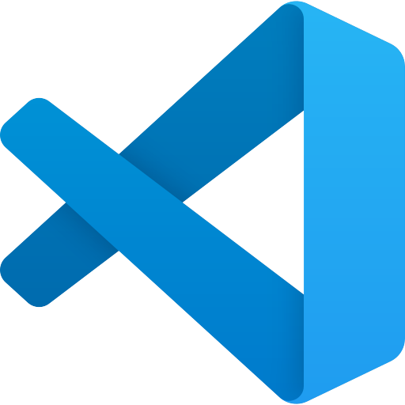

## About me

I am a web developer with basic knowledge of TypeScript, React and Node.js. I am especially interested in participating in team projects, learning and solving complex bugs.

  <table style="display=block;">
    <thead>
      <tr>
        <th>Category</th>
        <th>Technologies</th>
      </tr>
    </thead>
    <tbody>
      <tr>
        <td>Frontend</td>
        <td>
          
          
          
          
          
          
        </td>
      </tr>
      <tr>
        <td>Backend</td>
        <td>
          
          
          
        </td>
      </tr>
      <tr>
        <td>Tools</td>
        <td>
          
          
          
        </td>
      </tr>
      <tr>
        <td>Other</td>
        <td>
          
          
        </td>
      </tr>
      <tr>
        <td>Learn</td>
        <td>
          
          
        </td>
      </tr>
    </tbody>
  </table>

<h2>Experience</h2>

🚀 I have hands-on experience working on commercial projects where I utilized my expertise in TypeScript, React, Node.js, and Next.js to bring website designs to life and develop robust back-end solutions. In addition to commercial work, I've contributed to team projects and personal endeavors, which you can check out below.

👨‍💻 During my studies, I actively participated in team projects, where I applied my skills in TypeScript, React, Node.js, and Next.js to develop both front-end and back-end solutions. This experience not only enhanced my technical abilities but also reinforced the importance of communication, teamwork, and working within agile methodologies.

<h2 style="margin-bottom: 0;">Career Goals</h2>

🎯 My ultimate goal is to excel in full-stack development while continuously pushing the boundaries of web technologies. I thrive in environments where I can embrace new challenges, learn from peers, and apply my skills to impactful projects. Currently, I'm focused on mastering the Next.js framework and MySQL databases.

<em>I love connecting with different people!</em>

Сontact me

  
  
  
  

